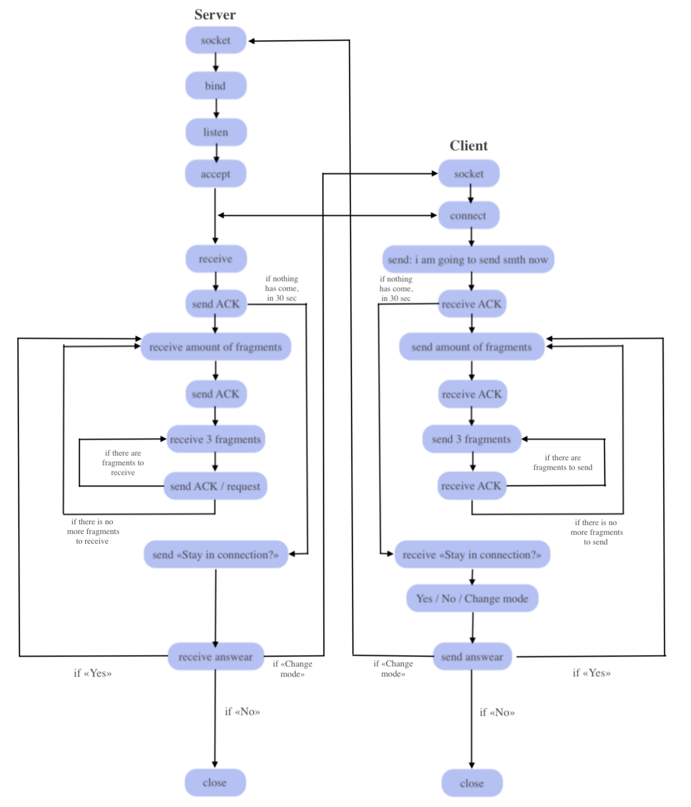

# About

This project is a result of the course Computer and Communication Networks (WS 2019/2020). The aim is to get UDP and TCP protocol and try to implement reliable protocol over UDP using TCP principles. 

# The Design:

It is a console application. The First step is to write the server IP address and client Ip at the computer which is going to be server(receive data) and then at the one which is going to be client (sent data). After finishing the process of sending, the client and server can change their roles. 

## Client: 
Client is able to set the max size of data block to be sent and than types in a format of data to be sent. The first thing done is sending the max size of a fragmentm, number of fragments and format of data to be sent. Then the data gets divided into fragments.

To every fragmnet the programs adds a header, which contains typecode (takes 5 bytes in the header), length (2 bytes), checksum (3 bytes) and order of the fragment (2 bytes). Checksum and order are meant to make the data transfer more reliable. The typecode can be the type of document, but lso there exist additional special typecodes:
- 0 - ACK
- 1 - I am going to send smth now
- 2 - amount of fragments
- 3 - fragment request
- 4 - stay in connection?
- 5 - stay or not to stay in conection
- 6 - message (text)

Then starts the sending itself: three fragments are sent and then the client side waits for confirmation about correct recival. In case one of the fragment was in correct, it is sent again. After finishing, in case of simple text (message), it gets printed at server's console after receiving, and in case it is a file, the path to it is printed in the console at the server side.

## Server
At first server receives the notification that client is going to send something and the from the next packet it gets max size of a fragmentm, number of fragments and format of data to be received. Then he starts to receive the fragments. After receiving each of them server checks if there was no data change using checksum and after each three it checks wether it has not lead too the change in order. If everything is ok, it saves the data and sends ACK to client, otherwise request to resend the wrong frament/-s. Also if the fragment was lost, the timer will timeout and server will send a request.
After receiving message - it is printed, after receiving file - its path is printed.

## Keep-alive
Also there is implemented keep-alive functionality. Every 30 seconds of inactivity server sends a question to the client if he still wants to stay in connection.

## The flow:


# Running the script:
THe script can be run in any IDE or with the command:
```
python3 ./tcp_over_udp.py
```


